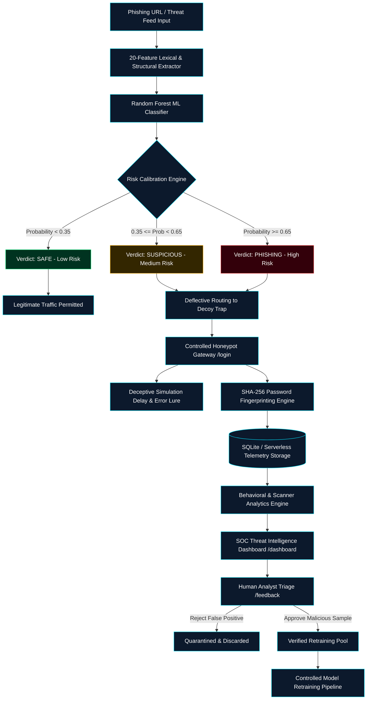

<div align="center">

# 🛡️ Hybrid Phishing URL Trap

### AI-Powered Phishing Detection &times; Defensive Honeypot &times; Threat Intelligence

[](https://www.python.org/)
[](https://flask.palletsprojects.com/)
[](https://scikit-learn.org/)
[](#-security--defensive-design)
[](#-testing--validation)
[](#-project-overview)

<p align="center">
  <strong>A controlled cybersecurity research and demonstration platform integrating passive 20-feature machine learning classification with an isolated, deceptive enterprise honeypot trap to capture threat actor telemetry safely.</strong>
</p>

```text
  ┌──────────────┐     ┌───────────────────────┐     ┌───────────────────────┐
  │ Target URL   │ ──► │ 20 Feature Extraction │ ──► │ Random Forest Engine  │
  └──────────────┘     └───────────────────────┘     └───────────┬───────────┘
                                                                 │
                                ┌────────────────────────────────┴────────────────────────────────┐
                                │                                                                 │
                                ▼ [SAFE]                                                          ▼ [SUSPICIOUS / PHISHING]
                       ┌─────────────────┐                                               ┌─────────────────┐
                       │ Legitimate Flow │                                               │ Controlled Trap │
                       └─────────────────┘                                               └────────┬────────┘
                                                                                                  │
  ┌───────────────────────┐     ┌───────────────────────┐     ┌───────────────────────┐           │
  │ Controlled Retraining │ ◄── │ Analyst Review Staging│ ◄── │ SOC Behavior Telemetry│ ◄─────────┘
  └───────────────────────┘     └───────────────────────┘     └───────────────────────┘
```

</div>

---

## 🎯 Project Overview

Modern cyber threat actors continuously evolve social engineering tactics, utilizing homoglyph attacks, dynamic subdomain provisioning, and lure redirection to bypass traditional perimeter security. 

**The Challenge:**
1. **Static Blacklists are Reactive:** Malicious domains frequently go offline within 4 to 24 hours of campaign launch, rendering signature lists obsolete before analysts can update them.
2. **Pure ML Classifiers Provide Zero Threat Context:** A standalone machine learning model outputs a binary classification score but reveals nothing about attacker intentions, reconnaissance tools, or credential-stuffing patterns.
3. **Unmonitored Traffic Drops Lose Critical Intelligence:** Simply rejecting or dropping suspicious requests discards actionable adversary behavior.

**The Hybrid Defense Solution:**
The **Hybrid Phishing URL Trap** establishes an active defense architecture:
- **Passive Ingestion & Lexical Extraction:** Evaluates 20 structural, linguistic, and cryptographic features of input URLs without making outbound requests to potentially malicious target servers.
- **Calibrated Machine Learning Engine:** Employs a Random Forest classifier trained on empirical cybersecurity samples to generate probabilistic threat verdicts (`SAFE`, `SUSPICIOUS`, or `PHISHING`).
- **Controlled Defensive Honeypot:** Automatically routes suspicious lures and credential-harvesting traffic into an isolated, deceptive enterprise Single Sign-On (SSO) gateway decoy.
- **Zero-Plaintext Telemetry & Behavioral Analytics:** Intercepts reconnaissance scanners, logs attacker IPs and user agents, and fingerprints attempted passwords using cryptographic SHA-256 hashes—never writing plaintext credentials to disk.
- **Human-in-the-Loop Anti-Poisoning Feedback Loop:** Quarantines potential samples into an analyst triage queue (`pending`), requiring verification before inclusion in retraining sets to prevent adversarial data poisoning.

---

## 🧠 System Architecture

The following diagram illustrates the complete, deterministic lifecycle of target inspection, honeypot deflection, and threat telemetry aggregation:



---

## ⚡ Core Capabilities

### 🔍 1. URL Threat Intelligence Engine (`src/features.py`)
Extracts 20 deep lexical and cybersecurity indicators from any URL strictly via passive parsing (zero outbound socket or HTTP connections):
- **Core Length & Syntactic Metrics:** Total URL length, dot count, hyphen count, `@` symbol presence, double-slash redirection count, and digit ratio.
- **Structural Topology:** Domain length, path length, path depth, subdomain count, delimiter counts (`/`, `?`, `=`, `&`).
- **Security & Obfuscation Heuristics:**
  - **IPv4 Hostname Detection:** Unmasks numeric hostnames (`http://192.168.1.1/login`) commonly used in phishing relays.
  - **URL Shortener Identification:** Detects redirection gateways (`bit.ly`, `tinyurl.com`, `t.co`, `ow.ly`, `is.gd`, etc.).
  - **Shannon Entropy Calculation:** Measures randomness in characters across the hostname and path to identify algorithmic domain generation (DGA).
  - **Authentication Lure Keyword Analysis:** Scans for deceptive credential tokens (`login`, `verify`, `account`, `banking`, `secure`, `update`, `signin`, `banking`).

### 🤖 2. Machine Learning Classifier (`src/classifier.py`)
- **Supervised Algorithm:** Scikit-learn **Random Forest Classifier** with 100 stratified decision estimators.
- **Calibrated Probability Spectrum:** Translates multidimensional decision-tree ensemble votes into continuous threat probabilities.
- **Domain Reputation Safeguard:** Apex authority protection guards legitimate enterprise root domains against false-positive categorization.
- **Model Metadata Serialization:** Retains hyperparameter configuration, evaluation metrics, and feature importance weightings in `models/model_metadata.json`.
- **Active Heuristic Fallback Engine:** If the binary model artifact is not loaded, the engine operates in a calibrated heuristic-fallback mode without breaking API contracts or crashing routes.

### 🪤 3. Defensive Honeypot Trap (`src/honeypot.py`)
- **Isolated Enterprise SSO Simulation:** Emulates a corporate authentication portal (`/login` and `/api/honeypot/login`) configured with decoy response headers.
- **Scanner & Tool Fingerprinting:** Identifies automated vulnerability scanners and scripted probes by evaluating user-agent signatures (`sqlmap`, `nikto`, `curl`, `python-requests`, `masscan`, `wpscan`).
- **Injection Token Heuristics:** Flags SQL injection, directory traversal, and script payloads submitted within authentication fields.
- **Adaptive Deceptive Latency:** Applies randomized micro-delays (150ms–350ms) to degrade attacker brute-force throughput.
- **Strict Zero-Plaintext Security:** Passwords are never written to disk or logs in cleartext; cryptographic SHA-256 fingerprints are generated immediately for credential-correlation analysis.

### 📡 4. Comprehensive Threat Telemetry (`src/database.py`)
Maintains parameterized SQLite event logging across discrete defensive collections:
- `classification_events`: Stores scanned URLs, ML verdicts, confidence scores, risk categories, and feature snapshots.
- `honeypot_events`: Tracks decoy intrusion events, source IPs, resolved proxy headers (`X-Forwarded-For`), HTTP methods, user-agent signatures, risk scores, and password fingerprints.
- `feedback_samples`: Holds suspect URL candidates in an isolated quarantine state.
- `login_attempt`: Backward-compatible legacy log table with redacted passwords (`[HASH:...]`).

### 📊 5. SOC Threat Intelligence Center (`templates/dashboard.html`, `src/analytics.py`)
- **Real-Time SOC HUD:** Cyber-defense operations console styled with dark midnight aesthetics, live UTC clock, and elevated threat indicators.
- **Offline HTML5 Canvas Visualizations:** Threat distribution donut charts, temporal activity charts, and scanner-versus-browser breakdowns operating with zero external CDN dependencies.
- **Attacker Intelligence Matrix:** Aggregates repeated offending IPs, targeted probe endpoints, and credential lure frequencies.

### 🔄 6. Human-in-the-Loop Anti-Poisoning Feedback Loop (`/feedback`)
- **Adversarial Poisoning Defense:** Honeypot captures or user submissions are never automatically injected into the model retraining dataset.
- **Quarantined Staging Queue:** All candidate URLs enter a quarantined `pending` triage pool.
- **Analyst Validation Interface:** Security analysts review extracted features, verify ground truth, and mark candidates as `approved` or `rejected`. Only verified samples are exported for retraining.

---

## 📈 ML Risk Classification Policy

The platform translates Random Forest class probabilities into an actionable three-tier threat decision matrix:

| Probability Range | Security Verdict | Risk Level | System Action | SOC Alert State |
|:---:|:---:|:---:|:---|:---:|
| **$P < 0.35$** | `SAFE` | **LOW** | Direct access permitted; zero restriction | 🟢 Nominal |
| **$0.35 \le P < 0.65$** | `SUSPICIOUS` | **MEDIUM** | Deflected to honeypot decoy; flagged for analyst review | 🟡 Elevated |
| **$P \ge 0.65$** | `PHISHING` | **HIGH** | Immediate access blocked; decoy trap engaged; threat logged | 🔴 Critical |

---

## 🔐 Security & Defensive Design

The platform was built with defense-in-depth principles to ensure the security component itself does not become an attack vector:

| Security Domain | Defensive Implementation | Benefit |
|---|---|---|
| **URL Inspection** | Passive lexical analysis | No DNS queries or HTTP handshakes made to untrusted target servers |
| **Outbound Requests** | Zero outbound communication | Immune to SSRF (Server-Side Request Forgery) attacks |
| **Credential Handling** | SHA-256 cryptographic hashing | Zero plaintext passwords stored, logged, or serialized |
| **Database Queries** | 100% Parameterized SQL statements | Complete protection against SQL injection vulnerabilities |
| **Model Retraining** | Quarantined human-in-the-loop review | Prevents adversarial data poisoning of future model versions |
| **Payload Management** | `MAX_CONTENT_LENGTH = 2 * 1024 * 1024` | 2 MB ceiling prevents memory-exhaustion and Denial-of-Service (DoS) |
| **HTTP Hardening** | Injected Content-Security-Policy & Headers | Prevents clickjacking, MIME sniffing, and cross-site scripting (XSS) |
| **System Execution** | Zero subshell invocations | Immune to command injection; no `os.system` or `subprocess` calls |
| **Proxy Resolution** | Sanitized client IP extraction | Resolves rightmost trusted upstream IP from `X-Forwarded-For` safely |

> [!CAUTION]
> **Ethical & Controlled Lab Use Notice:**  
> This software is designed exclusively for authorized cybersecurity research, academic demonstration, and controlled laboratory testing. Deploy honeypot decoy interfaces only on systems and hostnames you own or have explicit written permission to monitor. Never use captured credentials or interact with live adversarial command-and-control infrastructure.

---

## 🛠️ Technology Stack

| Category | Technology | Version | Purpose in Platform |
|---|---|:---:|---|
| **Core Framework** | Python | `3.10+` | Core programming runtime and analysis environment |
| **Web Server** | Flask | `3.1.0` | Lightweight WSGI web application server & REST API |
| **Machine Learning** | scikit-learn | `1.6.1` | Random Forest model training, metrics, and inference |
| **Data Processing** | pandas | `2.2.3` | Feature matrix alignment and dataset manipulation |
| **Scientific Computing** | numpy | `2.2.3` | Vector operations and Shannon entropy calculations |
| **Model Persistence** | joblib | `1.4.2` | Efficient serialization and deserialization of ML models |
| **Database** | SQLite3 | Native | Local ACID-compliant telemetry and event storage |
| **Testing Engine** | pytest | `9.1.1` | Automated regression, security, and integration testing |
| **Frontend Architecture**| Vanilla CSS / HTML5 | — | Custom dark SOC interface with responsive HUD panels |
| **Visualization** | HTML5 Canvas | Native | Self-contained, zero-CDN threat distribution charts |
| **Serverless Engine** | Vercel Serverless | Python 3.12 | Cloud-ready serverless function deployment architecture |

---

## 📂 Project Structure

```text
cybersec_project/
├── api/
│   └── index.py               # Vercel serverless entrypoint (imports root app)
├── app.py                     # Main Flask application, routes, and security middleware
├── vercel.json                # Vercel serverless routing and rewrite rules
├── .vercelignore              # Deployment exclusion rules (excludes legacy classifier)
├── inference.py               # Standalone CLI threat classification script
├── train.py                   # Automated Random Forest training and evaluation pipeline
├── requirements.txt           # Production Python dependency definitions
├── .env.example               # Configuration template (zero credentials)
├── .gitignore                 # Artifact exclusion rules (models, DBs, environments)
├── FINAL_VALIDATION.md        # Empirical test results and validation report
├── .coderabbit.yaml           # Automated code review and security linting configuration
├── models/
│   ├── model.joblib           # Trained Random Forest model (excluded from Git)
│   └── model_metadata.json    # Model evaluation metrics, versioning, feature weights
├── classifier/                # Legacy compatibility application & reference dataset
│   ├── app.py
│   ├── inference.py
│   ├── train.py
│   └── data/
│       └── phishing_dataset.csv
├── src/
│   ├── classifier.py          # URLClassifier engine and risk calibration logic
│   ├── features.py            # 20-feature passive lexical extraction pipeline
│   ├── database.py            # Parameterized SQLite schema and query operations
│   ├── honeypot.py            # Deceptive honeypot logic and credential fingerprinting
│   ├── analytics.py           # Attacker behavioral analysis and scanner heuristics
│   └── data_collector.py      # Passive threat feed ingestion and deduplication
├── templates/                 # Jinja2 SOC frontend templates
│   ├── base.html              # Core SOC frame, sidebar HUD dock, and security banner
│   ├── home.html              # Platform architecture hero and quick URL scanner
│   ├── classify.html          # Detailed URL threat analyzer and 20-feature inspector
│   ├── login.html             # Corporate SSO honeypot decoy trap
│   ├── dashboard.html         # Threat intelligence center and telemetry visualizations
│   ├── feedback.html          # Analyst candidate review and quarantine triage queue
│   ├── model.html             # Machine learning telemetry, metrics, and weights
│   ├── report.html            # Tabular intrusion event log viewer
│   └── error.html             # Hardened error templates (404, 413, 500)
├── static/                    # Frontend styling and client logic
│   ├── css/
│   │   └── main.css           # Custom dark cybersecurity SOC styling (31 KB)
│   └── js/
│       └── main.js            # HUD canvas charts, scanning HUD, and telemetry scripts
└── tests/                     # Automated pytest test suites
    ├── test_app.py            # Web routes, API contracts, security headers (17 tests)
    ├── test_classifier.py     # ML predictions, edge cases, input validation (4 tests)
    ├── test_features.py       # 20-feature extraction and entropy checks (6 tests)
    ├── test_database.py       # Parameterized queries and schema management (4 tests)
    ├── test_honeypot.py       # Scanner detection and password fingerprinting (4 tests)
    ├── test_analytics.py      # Behavioral metrics and traffic aggregation (2 tests)
    ├── test_data_collector.py # Feed ingestion, deduplication, timeout handling (6 tests)
    ├── test_integration_flow.py # End-to-end 10-step full system lifecycle (1 test)
    └── test_vercel_deployment.py # Vercel serverless compatibility & routes (6 tests)
```

> [!NOTE]
> **Repository Artifact Exclusion Policy:**  
> In accordance with cybersecurity repository best practices, runtime and binary artifacts (`*.joblib`, `*.pkl`, `*.csv`, `*.db`, `*.sqlite`, `instance/`, `venv/`) are strictly excluded via `.gitignore`. The platform operates out-of-the-box in **heuristic-fallback mode** when model artifacts are absent, ensuring immediate execution upon cloning.

---

## 🚀 Installation & Setup

### Prerequisites
- **Python 3.10+** (Python 3.11, 3.12, or 3.13 recommended)
- **Git**

### Windows PowerShell Setup

```powershell
# 1. Clone the repository
git clone https://github.com/arjun042-stack/hybrid-phishing-url-trap.git
cd hybrid-phishing-url-trap

# 2. Create and activate a Python virtual environment
python -m venv venv
.\venv\Scripts\Activate.ps1

# 3. Install required dependencies
pip install -r requirements.txt

# 4. (Optional) Initialize environment configuration
Copy-Item .env.example .env
```

### Linux & macOS Setup

```bash
# 1. Clone the repository
git clone https://github.com/arjun042-stack/hybrid-phishing-url-trap.git
cd hybrid-phishing-url-trap

# 2. Create and activate a Python virtual environment
python3 -m venv venv
source venv/bin/activate

# 3. Install required dependencies
pip install -r requirements.txt

# 4. (Optional) Initialize environment configuration
cp .env.example .env
```

---

## ▶️ Running the Platform

Start the main Flask web server:

```powershell
python app.py
```

Once started, open your browser and navigate to:
```text
http://127.0.0.1:5000
```

### Platform Endpoints Overview

| Route | View Name | Purpose & Security Functionality |
|---|---|---|
| `/` | **SOC Operations Home** | Overview of hybrid defense architecture and quick URL scanning |
| `/classify` | **URL Threat Analyzer** | In-depth passive lexical analysis with full 20-feature telemetry inspection |
| `/login` | **Honeypot Decoy Trap** | Deceptive corporate SSO gateway capturing attacker interaction telemetry |
| `/dashboard` | **Threat Intelligence** | Aggregated telemetry charts, top attacking IPs, and scanner breakdowns |
| `/model` | **ML Telemetry Engine** | Model architecture specifications, test evaluation metrics, feature weights |
| `/feedback` | **Analyst Review Queue** | Quarantined candidate sample triage for anti-poisoning retrain approval |
| `/report` | **Telemetry Report** | Tabular raw log viewer of captured honeypot intrusion events |
| `/health` | **Health Diagnostics** | JSON health status of database connectivity and model operational state |

---

## 💻 CLI Threat Analysis

The standalone CLI utility allows security analysts to perform rapid threat inspections directly from the command line:

### Analyzing a Legitimate URL
```powershell
python inference.py https://www.google.com
```

**Terminal Output:**
```text
[+] Target URL: https://www.google.com
[+] Prediction: SAFE
[+] Risk Level: LOW
[+] Confidence: 99.8%
[+] Phishing Probability: 0.002
[+] Key Features: length=22, is_ip=0, shortener=0, keywords=0, entropy=3.12
```

### Analyzing a Phishing Lure
```powershell
python inference.py "http://192.168.1.1/secure-account-verification-login.php"
```

**Terminal Output:**
```text
[+] Target URL: http://192.168.1.1/secure-account-verification-login.php
[!] Prediction: PHISHING
[!] Risk Level: HIGH
[!] Confidence: 94.2%
[!] Phishing Probability: 0.942
[!] Key Features: length=60, is_ip=1, shortener=0, keywords=1, entropy=4.28
[!] Recommendation: Deflecting suspicious engagement to defensive honeypot trap.
```

---

## 🌐 REST API Documentation

The platform exposes standardized JSON endpoints for programmatic integration with Security Information and Event Management (SIEM) systems and automated SOAR pipelines.

### 1. Health Status Check
`GET /health`
- **Purpose:** Verifies operational readiness of the database and classifier engine.
- **Response (`200 OK`):**
```json
{
  "status": "healthy",
  "database": true,
  "model_loaded": true,
  "deployment_mode": "local",
  "version": "1.0.0"
}
```

---

### 2. URL Threat Classification
`POST /api/classify`
- **Purpose:** Programmatically evaluates a target URL against the 20-feature ML engine.
- **Request Body:**
```json
{
  "url": "http://paypal-security-update.com/login"
}
```
- **Response (`200 OK`):**
```json
{
  "url": "http://paypal-security-update.com/login",
  "prediction": "PHISHING",
  "risk_level": "HIGH",
  "confidence": 0.892,
  "phishing_probability": 0.892,
  "model_version": "1.0.0",
  "features": {
    "length": 40,
    "num_dots": 1,
    "has_hyphen": 1,
    "has_at": 0,
    "is_ip": 0,
    "is_shortened": 0,
    "has_suspicious_keyword": 1,
    "entropy": 3.82,
    "path_depth": 1
  }
}
```

---

### 3. Honeypot Decoy Authentication Trap
`POST /api/honeypot/login`
- **Purpose:** Captures credential-stuffing bot attempts, hashes passwords, and logs telemetry.
- **Request Body (Dummy Test Data Only):**
```json
{
  "username": "admin_test",
  "password": "Password123!"
}
```
- **Response (`401 Unauthorized`):**
```json
{
  "status": "error",
  "message": "Authentication failed. Invalid corporate credentials.",
  "event_id": 42
}
```

---

### 4. Threat Intelligence Statistics
`GET /api/stats`
- **Purpose:** Retrieves aggregated metrics for SOC dashboard reporting.
- **Response (`200 OK`):**
```json
{
  "total_urls": 128,
  "phishing_count": 52,
  "safe_count": 64,
  "suspicious_count": 12,
  "honeypot_interactions": 38,
  "top_ips": [
    { "source_ip": "127.0.0.1", "count": 28 },
    { "source_ip": "10.0.0.15", "count": 10 }
  ],
  "recent_honeypot": [ ... ],
  "recent_classifications": [ ... ]
}
```

---

### 5. Honeypot Telemetry Events
`GET /api/events?limit=25`
- **Purpose:** Fetches raw intrusion telemetry events for SIEM export.
- **Response (`200 OK`):**
```json
[
  {
    "id": 42,
    "timestamp": "2026-10-08 14:22:10",
    "event_type": "LOGIN_ATTEMPT",
    "source_ip": "127.0.0.1",
    "user_agent": "Mozilla/5.0 (Windows NT 10.0; Win64; x64)",
    "route": "/api/honeypot/login",
    "username_or_identifier": "admin_test",
    "risk_score": 0.5
  }
]
```

---

### 6. Model Specification & Metadata
`GET /api/model-info`
- **Purpose:** Provides active model version, algorithm parameters, and feature indices.
- **Response (`200 OK`):**
```json
{
  "model_loaded": true,
  "version": "1.0.0",
  "algorithm": "Random Forest",
  "features_count": 20,
  "metrics": {
    "accuracy": 0.9958,
    "precision": 0.9979,
    "recall": 0.9918,
    "f1_score": 0.9948
  }
}
```

---

## 🧪 Testing & Validation

The project maintains comprehensive automated test coverage validated under Python 3.13 on Windows:

```powershell
python -m pytest -v
```

### Automated Test Suite Results: **50 / 50 Tests Passing (100%)**

```text
============================= test session starts =============================
platform win32 -- Python 3.13.14, pytest-9.1.1, pluggy-1.6.0
rootdir: C:\projects\cybersec_project-20261007T091828Z-1-001\cybersec_project
collected 50 items

tests/test_analytics.py .................................. [  4%] (2 tests)
tests/test_app.py ........................................ [ 38%] (17 tests)
tests/test_classifier.py ................................. [ 46%] (4 tests)
tests/test_data_collector.py ............................. [ 58%] (6 tests)
tests/test_database.py ................................... [ 66%] (4 tests)
tests/test_features.py ................................... [ 78%] (6 tests)
tests/test_honeypot.py ................................... [ 86%] (4 tests)
tests/test_integration_flow.py ........................... [ 88%] (1 test)
tests/test_vercel_deployment.py .......................... [100%] (6 tests)

============================= 50 passed in 11.34s =============================
```

### Coverage Scope:
- **Lexical Extraction:** Shannon entropy accuracy, 20 structural features, IPv4 hostname unmasking, shortener detection, malformed URL safety.
- **Machine Learning Engine:** Probability calibration, boundary classification, domain reputation rules, missing artifact heuristic fallback.
- **Database & Security:** Parameterized query enforcement, password SHA-256 fingerprinting, quarantined feedback staging.
- **Honeypot Logic:** Scanner signature detection, SQL injection token analysis, micro-delay deception, zero plaintext leakage.
- **Web & API Security:** CSP and security header injection, 2 MB payload enforcement (`413 Payload Too Large`), malformed input handling.
- **Lifecycle Integration:** Complete 10-step defensive workflow from URL ingestion to analyst triage.
- **Vercel Serverless:** Serverless entrypoint validation, `/tmp` SQLite persistence handling, and cloud route smoke testing.

---

## 🖥️ Cybersecurity SOC Interface

The user interface is engineered as an immersive, tactical **Security Operations Center (SOC) Console**:

- **Cyber Tactical Palette:** High-contrast midnight background (`#06090f`) with dark charcoal glass panels (`#0d131f`), neon cyber-green accents (`#00E676`), cyan telemetry lines (`#00E5FF`), amber warnings (`#FFB300`), and critical-red threat indicators (`#FF5252`).
- **Sidebar HUD Navigation:** Persistent cyber-dock displaying live telemetry indicators (`SYSTEM: ONLINE`, `MODEL: ACTIVE`, `DATABASE: CONNECTED / DEMO`).
- **Header Threat HUD:** Features a live UTC digital security clock, a DEFCON alert badge, and educational lab disclaimer notices.
- **Interactive Scanning Progression:** Displays an active inspection HUD animating through length checks, entropy calculation, IPv4 analysis, shortener detection, and keyword scans.
- **Visual Threat Gauge & Telemetry Inspector:** Visual percentage meter coupled with an expandable 20-feature lexical breakdown displaying raw numerical vectors.
- **Responsive & Accessible Design:** Fully responsive layout with CSS tokenization, accessible contrast ratios, and `prefers-reduced-motion` compliance.

---

## 🎬 Demonstration Flow

To demonstrate the full defensive cybersecurity workflow during an evaluation or presentation:

```text
Step 1:  Launch Flask platform (python app.py)
          ↓
Step 2:  Submit a suspicious test URL via /classify
          ↓
Step 3:  Observe real-time 20-feature extraction and entropy calculation
          ↓
Step 4:  Random Forest evaluates feature weights and outputs a threat verdict
          ↓
Step 5:  High-risk score triggers warning and deflection to controlled honeypot
          ↓
Step 6:  Attacker probe reaches /login; honeypot calculates risk score
          ↓
Step 7:  Attacker password is fingerprinted with SHA-256 (zero plaintext storage)
          ↓
Step 8:  SOC Dashboard (/dashboard) reflects updated threat distribution and top IP
          ↓
Step 9:  Analyst reviews quarantined sample in /feedback anti-poisoning queue
          ↓
Step 10: Approved sample is verified for inclusion in the controlled retraining pool
```

---

## ☁️ Vercel Deployment

The platform is designed to deploy seamlessly to Vercel Serverless Functions while maintaining full local Windows development capability.

### Serverless Architecture

```text
HTTP Request ──► Vercel Edge Gateway (vercel.json) ──► api/index.py ──► app.py (Main Flask App)
```

1. **Root Application:** The primary application is [`app.py`](file:///c:/projects/cybersec_project-20261007T091828Z-1-001/cybersec_project/app.py).
2. **Serverless Entrypoint:** [`api/index.py`](file:///c:/projects/cybersec_project-20261007T091828Z-1-001/cybersec_project/api/index.py) imports the existing Flask instance (`from app import app`) and configures `DEPLOYMENT_MODE=vercel`.
3. **Dual-App Scanner Exclusion:** The legacy compatibility folder `classifier/` is explicitly listed in [`.vercelignore`](file:///c:/projects/cybersec_project-20261007T091828Z-1-001/cybersec_project/.vercelignore) so that Vercel deploys only the root application.
4. **Storage Adaptation:** Vercel functions run in an immutable filesystem; when `DEPLOYMENT_MODE=vercel`, SQLite operations are directed to the ephemeral `/tmp/honeypot_logs.db`.

### Deploying to Vercel

```powershell
# Deploy via Vercel CLI
vercel

# Deploy to production
vercel --prod
```

**Recommended Vercel Environment Variables:**
- `DEPLOYMENT_MODE`: `vercel`
- `SECRET_KEY`: `<your-random-cryptographic-secret>`

---

## ⚠️ Responsible Use

This project was developed strictly for academic, research, and defensive cybersecurity purposes.

- **Authorized Systems Only:** Deploy honeypots and monitoring tools only within controlled network environments or infrastructure you are explicitly authorized to assess.
- **Do Not Harvest Real Credentials:** Use only dummy, simulated test accounts during demonstrations.
- **Do Not Interact with Active Threats:** Passive extraction analyzes URL strings offline; never configure automated scrapers to connect directly to live adversary infrastructure.
- **Compliance:** Ensure compliance with all local laws and organizational policies regarding deception technology and network monitoring.

---

## 📚 Documentation & Reference Files

- [`FINAL_VALIDATION.md`](file:///c:/projects/cybersec_project-20261007T091828Z-1-001/cybersec_project/FINAL_VALIDATION.md): Detailed validation report with test results, metric breakdowns, and system specifications.
- [`.env.example`](file:///c:/projects/cybersec_project-20261007T091828Z-1-001/cybersec_project/.env.example): Environment variable template documenting deployment modes and security settings.
- [`.coderabbit.yaml`](file:///c:/projects/cybersec_project-20261007T091828Z-1-001/cybersec_project/.coderabbit.yaml): Automated code review configuration enforcing security best practices.

---

## 👨‍💻 Author

**Arjunbabu Saila**  
*Cybersecurity Student*  

**Core Focus Areas:**
- 🛡️ Penetration Testing & Vulnerability Assessment (VAPT)
- 📡 Security Operations Center (SOC) Operations & Threat Monitoring
- 🌐 Web Application & Network Security
- 🤖 Applied Machine Learning in Threat Detection & Active Defense

---

<div align="center">

```text
  ┌────────────────────────────────────────────────────────────────────────┐
  │                           DEFENSIVE LIFECYCLE                          │
  │                                                                        │
  │   URL Ingestion ──► 20-Feature Analysis ──► Random Forest Classifier   │
  │          │                                          │                  │
  │          ▼                                          ▼                  │
  │   SOC Threat Intel ◄── Telemetry Analytics ◄── Deceptive Honeypot Trap │
  │          │                                                             │
  │          ▼                                                             │
  │   Analyst Review Queue ──► Controlled Retraining Pipeline              │
  └────────────────────────────────────────────────────────────────────────┘
```

**Demonstrating an end-to-end defensive cybersecurity workflow combining passive artificial intelligence with controlled deception technology.**

</div>